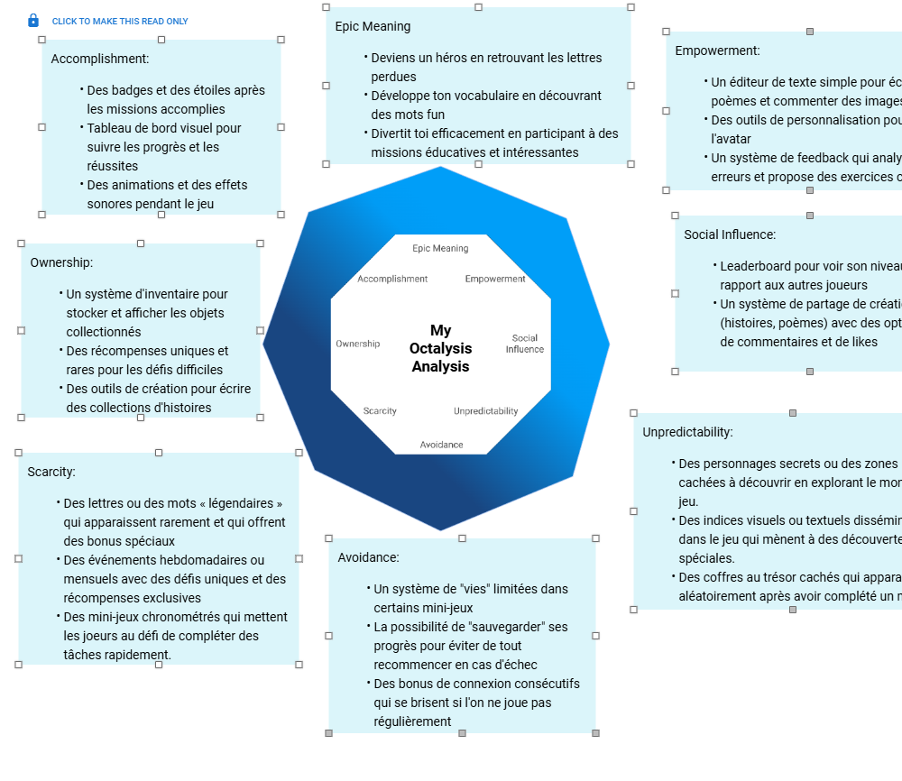

# Game-design-World-Explorer
  
La dyslexie représente un défi majeur pour les enfants dans le développement des compétences en lecture et en écriture, nécessitant souvent des outils éducatifs accessibles et engageants pour accompagner leur apprentissage. Les méthodes traditionnelles manquent parfois d’interactivité et de motivation pour maintenir l’attention des jeunes apprenants.

Ce projet présente **« World Explorer »**, un jeu éducatif développé avec **Unity3D**, conçu pour améliorer les compétences en littératie des enfants dyslexiques âgés de 6 à 12 ans grâce à des mini-jeux ludiques et des interfaces adaptées à la dyslexie. Le jeu se déroule sur trois îles thématiques : **l’Île des Voyelles**, **l’Île des Consonnes**, **l’Île des Combinaisons** ainsi qu’une **Île des Mots**. Il s’appuie sur un retour multisensoriel en intégrant des éléments tels que la police OpenDyslexic, des visuels à fort contraste et des indices sonores, afin de répondre aux besoins spécifiques des apprenants dyslexiques.

Développé à l’aide d’outils comme Unity3D, Figma, Freepik, ClipChamp, etc., le prototype intègre des éléments de gamification (par exemple : badges, Lettres Légendaires) inspirés du **Framework Octalysis** pour renforcer la motivation.

Ce travail propose non seulement un prototype fonctionnel pour des contextes éducatifs, mais contribue également au domaine des jeux sérieux en mettant en lumière le potentiel des outils numériques ludiques et accessibles pour un apprentissage inclusif.

## Framework Octalysis

## Île des Voyelles

**Jeu de paire**: Le joueur dispose de 40 secondes pour retrouver toutes les paires de cartes sur lesquelles sont inscrites les voyelles (a,e,i,o,u). Durant ce temps, il peut retourner librement les cartes deux par deux. Si les deux cartes affichent la même voyelle, la paire est validée, reste visible et le score augmente. Dans le cas contraire, les cartes sont rapidement retournées face cachée. La partie se termine soit lorsque le joueur a trouvé toutes les paires (victoire), soit lorsque le temps est écoulé (échec). Si toutes les paires sont découvertes avant la fin du temps imparti, le joueur gagne ; sinon, il perd mais peut relancer une nouvelle partie.

## Île des Consonnes

**Tir à la consonne**: Le joueur dispose d’un lance-pierre placé en bas de l’écran, avec une balle prête à être lancée. Cinq nuages, chacun portant une consonne différente (par exemple : B, D, P, T, S), défilent horizontalement de gauche à droite ; lorsqu’un nuage sort de l’écran à droite, il réapparaît automatiquement à gauche. À chaque tour, une consigne sonore prononce une consonne que le joueur doit écouter attentivement. Il doit ensuite attendre que le nuage correspondant soit aligné verticalement avec la balle pour appuyer sur un bouton (ou cliquer) et lancer le tir. Si la balle touche le bon nuage, celui-ci disparaît ; en cas d’erreur, aucun nuage ne disparaît et le joueur peut réessayer. Il dispose de 60 secondes pour faire disparaître tous les nuages. Il gagne s’il réussit à éliminer toutes les consonnes dans le temps imparti, sinon la partie est perdue, mais peut être rejouée.

## Île des combinaisons

**Mot-cible**: Un mot est affiché en haut, ensuite des boutons de syllabes apparaissent dans la zone de réponse. Certaines syllabes sont correctes (ex. "pa", "pa"), d’autres par contre sont fausses (appelées "leurres", comme "po", "pe"). Le joueur clique sur les syllabes pour les placer dans la zone de construction. Une fois toutes les syllabes placées, on vérifie si la combinaison reconstitue correctement le mot cible. Si le mot est correct, le jeu affiche un message de succès. Il passe automatiquement au mot suivant (ou bien attend une action du joueur selon les règles finales).

